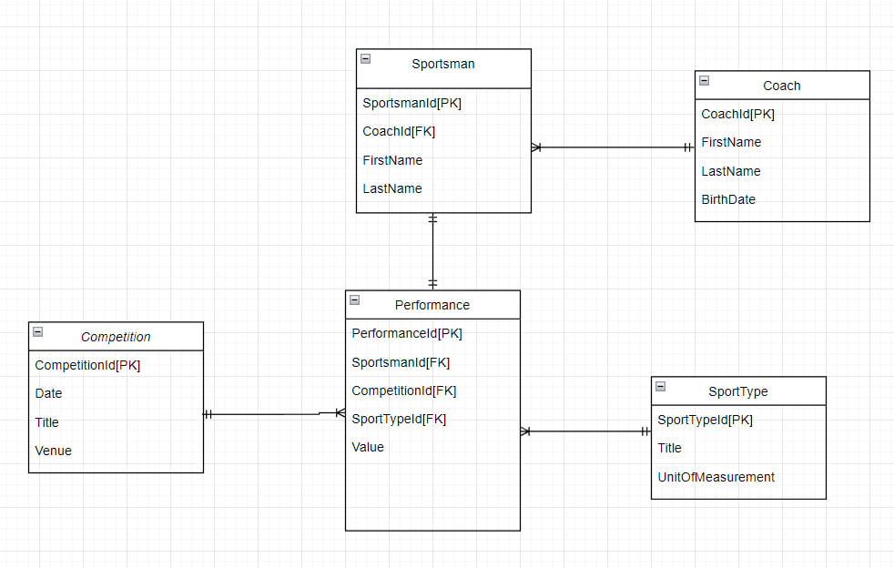

## Доменная область: SportCompetition (Спортивные соревнования).

---

## Описание

Есть 5 сущностей:

- Тренер

- Спортсмен

- Выступление

- Соревнование

- Вид спорта

### Тренер - Coach

Имеет поля: CoachId (PK), имя, фамилия, дату рождения.

### Спортсмен - Sportsman

Имеет поля: SportsmanId (PK), CoachId (FK), имя, фамилию.

### Соревнование - Competition

Имеет поля: CompetitionId (PK), дату проведения, название, место проведения.

### Вид спорта - SportType

Имеет поля: SportTypeId (PK), название, меру результата.

### Выступление/результат - Performance

Имеет поля: PerformanceId (PK), SportsmanId (FK), SportTypeId (FK), CompetitionId(FK), результат.

## Связи

У одного тренера может быть множество учеников (1 to Many).

У одного выступления может быть несколько результатов (1 to Many).

У одного вида спорта может быть множество результатов (1 to Many).

У одного спортсмена может быть 1 выступление (1 to 1).